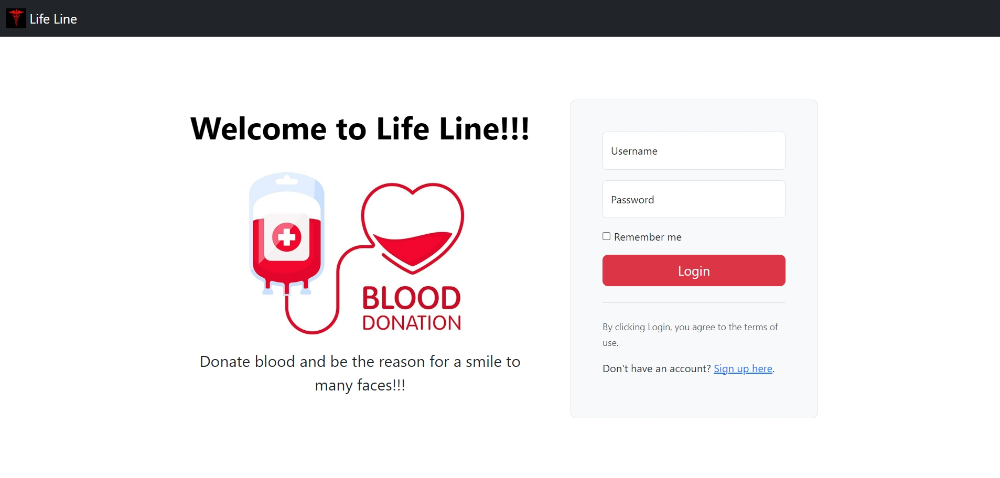
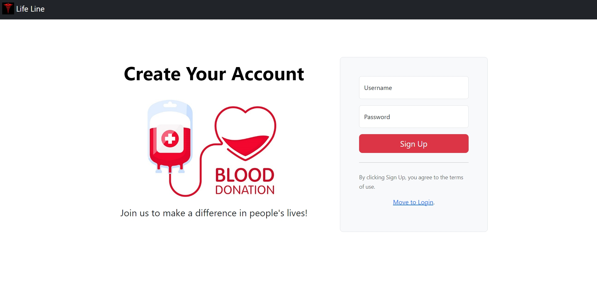
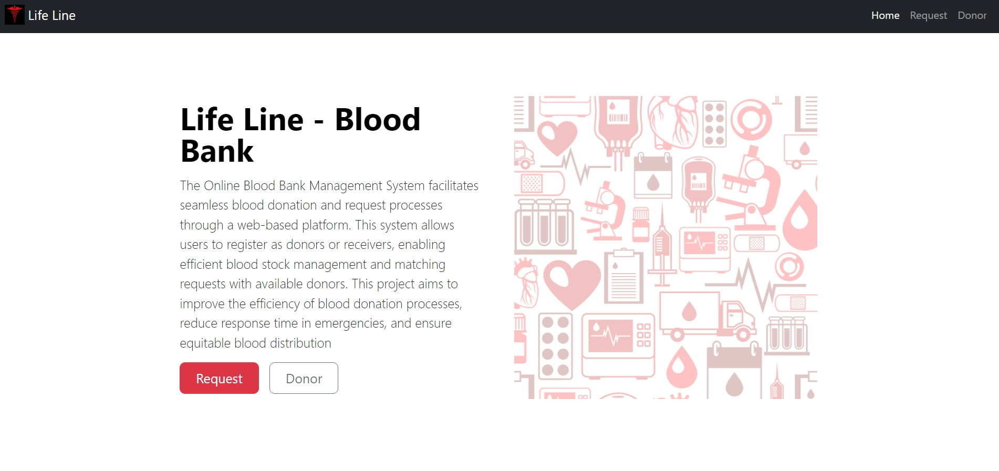
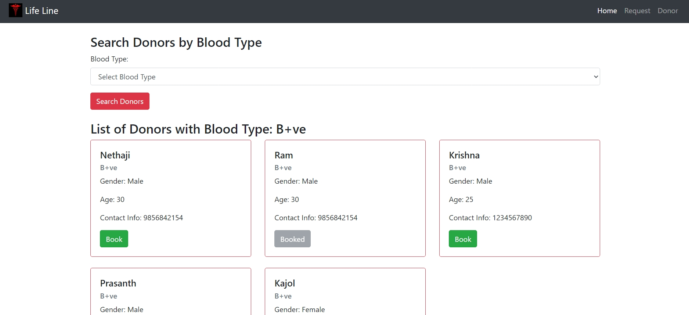
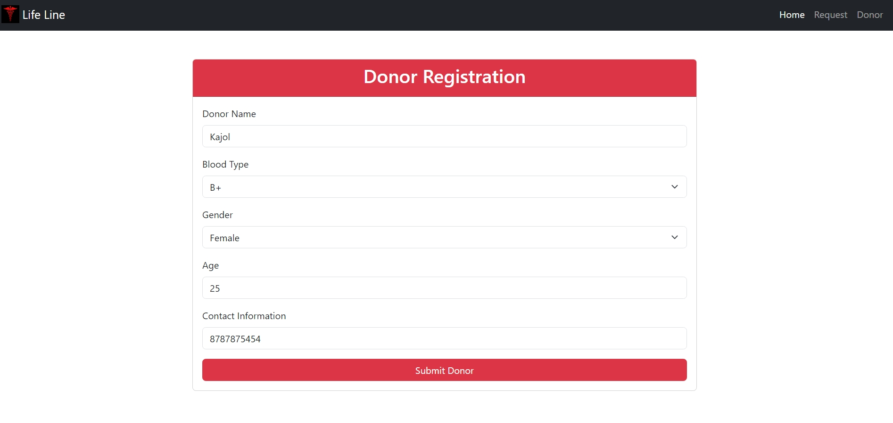
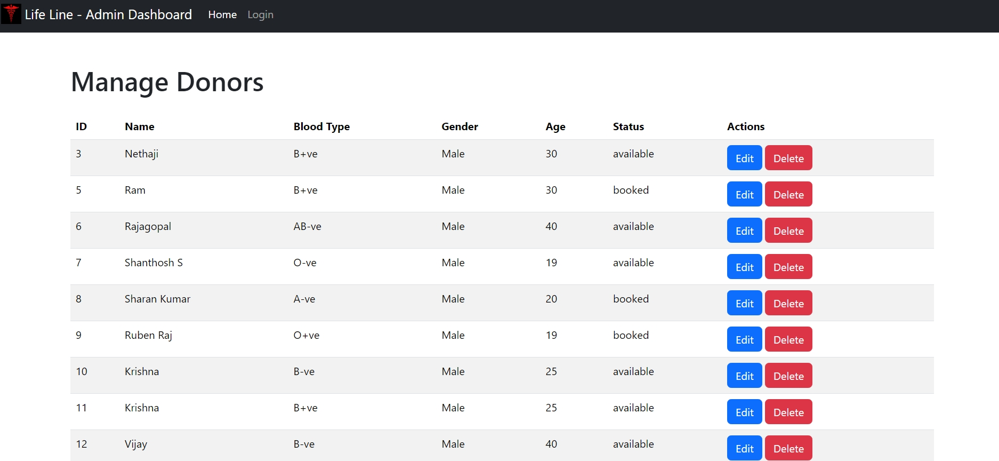

# 🩸Lifeline - Online Blood Bank System

This repository contains the code for an online blood bank system developed as part of the CS19542 Internet Programming Lab course. The system allows users to request blood and register as donors, with an admin dashboard for managing donor information.

## 📚 Table of Contents

- [Introduction](#introduction)
- [Features](#features)
- [Technologies Used](#technologies-used)
- [Database Structure](#database-structure)
- [How to Run](#how-to-run)

## 📌 Introduction

**Lifeline** is an online platform designed to simplify the process of blood donation and requests. Users can sign up, search for available blood groups, or register as donors. Admins have the ability to manage donor information through an admin dashboard.

## ⛓️‍💥 Features

- **User Login/Signup**: New users can register, and existing users can log in to access the system.
- **Blood Request**: Users can search for available blood by group.
- **Become a Donor**: Users can register to become a donor by providing relevant details.
- **Admin Dashboard**: The admin can log in with the following credentials:
  - Username: `admin`
  - Password: `admin`
  - Admins can edit or delete donor records.
  
## 🤖 Technologies Used

- HTML, CSS, JavaScript
- PHP (for server-side scripting)
- MySQL (for database management)
- Bootstrap (for responsive design)

## 🗃️ Database Structure

The system uses two MySQL tables:

1. **Users Table**:
   - Stores usernames and passwords for user authentication.

2. **Donors Table**:
   - Stores details of blood donors including name, blood group, contact details, etc.

## 🖥️ How to Run

**1. Clone the repository:**

   ```bash
   git clone https://github.com/Sabarish234/CS19542---Internet-Programming-Lab.git
   ```
**2. Set Up XAMPP:**
Download and install XAMPP (or any similar local server environment).
Start the Apache and MySQL services from the XAMPP Control Panel.

**3. Move Files to the htdocs Folder:**
Place the cloned project folder into the htdocs directory in your XAMPP installation. The path is typically C:\xampp\htdocs\ on Windows.

**4. Create the Database in MySQL:**
Open your browser and go to http://localhost/phpmyadmin to access the MySQL interface.
Create a new database (e.g., lifeline_db).
Import the provided SQL file (if available) or manually create the required tables:

Users Table: Stores usernames and passwords for user authentication.
Donors Table: Stores donor details like name, blood_type, age, gender, contact_info, status.
```
CREATE TABLE users (
    id INT AUTO_INCREMENT PRIMARY KEY,
    username VARCHAR(50) NOT NULL,
    password VARCHAR(255) NOT NULL
);

CREATE TABLE donors (
    id INT AUTO_INCREMENT PRIMARY KEY,
    name VARCHAR(100),
    blood_group VARCHAR(3),
    age INT,
    gender VARCHAR(10),
    contact_info VARCHAR(20),
    status VARCHAR(20)
);
```
**5. Configure the Database Connection in PHP:**
Open the PHP files in your project and ensure that the database connection details match your MySQL setup (database name, username, password).

**6. Access the Application:**
In your browser, go to http://localhost/<project-folder> to access the Lifeline blood bank system.
The login/signup page should appear. From there, you can:
Log in as a user or admin (admin credentials: username admin, password admin).
Search for available blood or register as a donor.

**7. Admin Dashboard:**
Log in using the admin credentials (username: admin, password: admin) to access the admin dashboard.
The admin can view, edit, or delete donor records.

## ✨ Application Preview

**Login page:**



**Signup page:**



**Home page:**



**Request page:***



**Donor page:**



**Admin page:**


